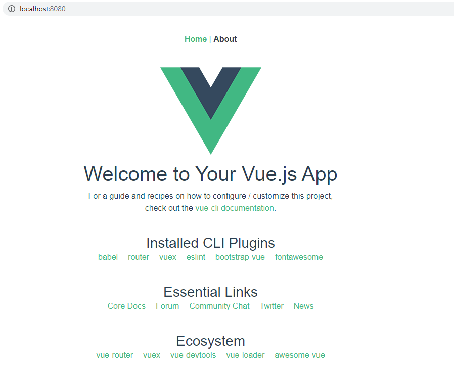

## Production
Has UI development been completed?.  
You will now build the UI and enable it to be deployed in the Spring Boot application.  

The spring boot distributes resources that exist at the location set in `spring.web.resources.static-locations` Property by default.
Therefore, the build file of the Vue project must be located in that directory.  

### outputDir
You can change build output directory using outputDir property in vue.config.js

```js
const path = require('path')

module.exports = {
    outputDir: path.resolve(__dirname, '../resources/static/dist'),
};
```

### indexPath
If the springboot application uses a premarker template engine, use the .ftlh file that exists in the templates folder as a template.  
You can specify the path to the outputDir baseline by setting the indexPath property to the index.html generated by default.

```
module.exports = {
  indexPath: '../../templates/index.ftlh',
  chainWebpack: config => {
    config.plugin('html')
        .tap(args => {
          args[0].minify = false
          args[0].interpolate = true
          return args
        })
  }
};
```

You can also change the HtmlWebpackPlugin option so that you can use the Freemarker syntax.  

For example, you can set the value of the lang property in an HTML document from the locale.  
```html
<!DOCTYPE html>
<html lang="<%= '\${.locale?split(\"_\")[0]}' %>">
</html>
```

